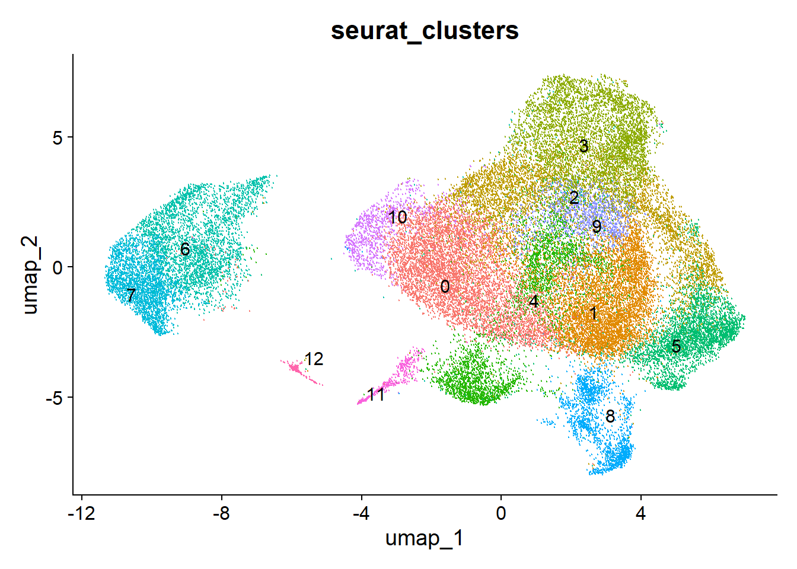
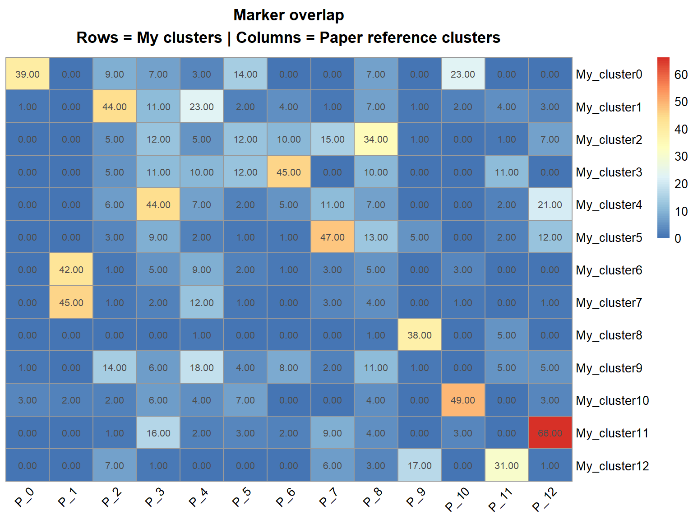
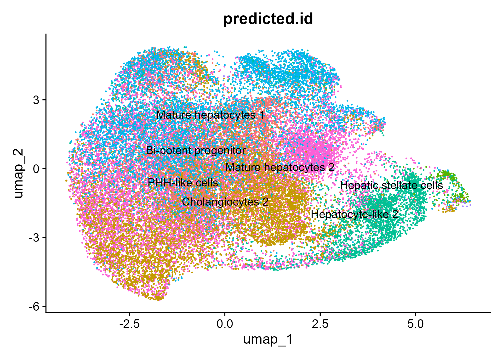
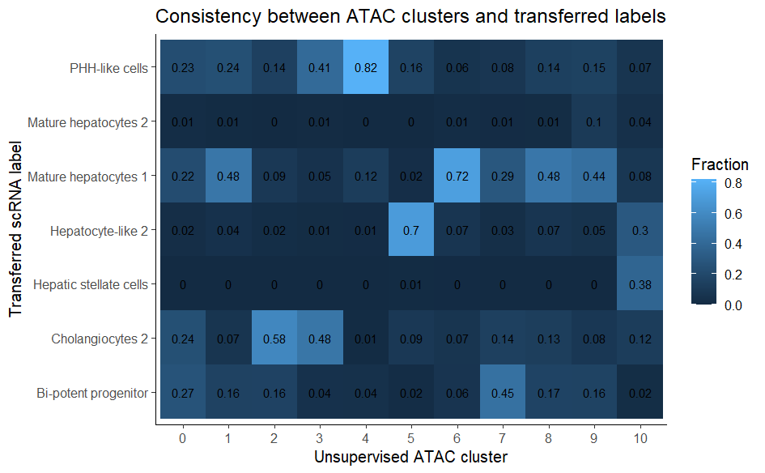
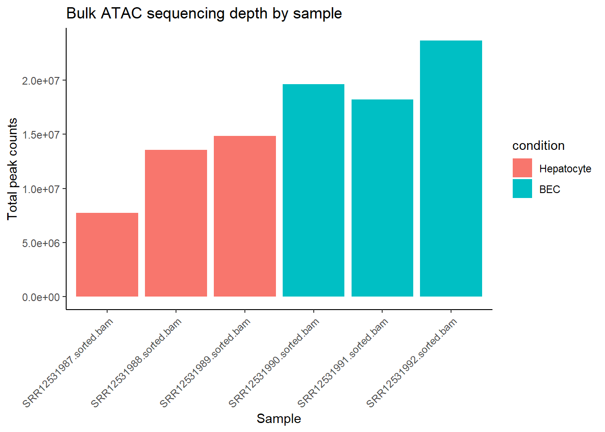
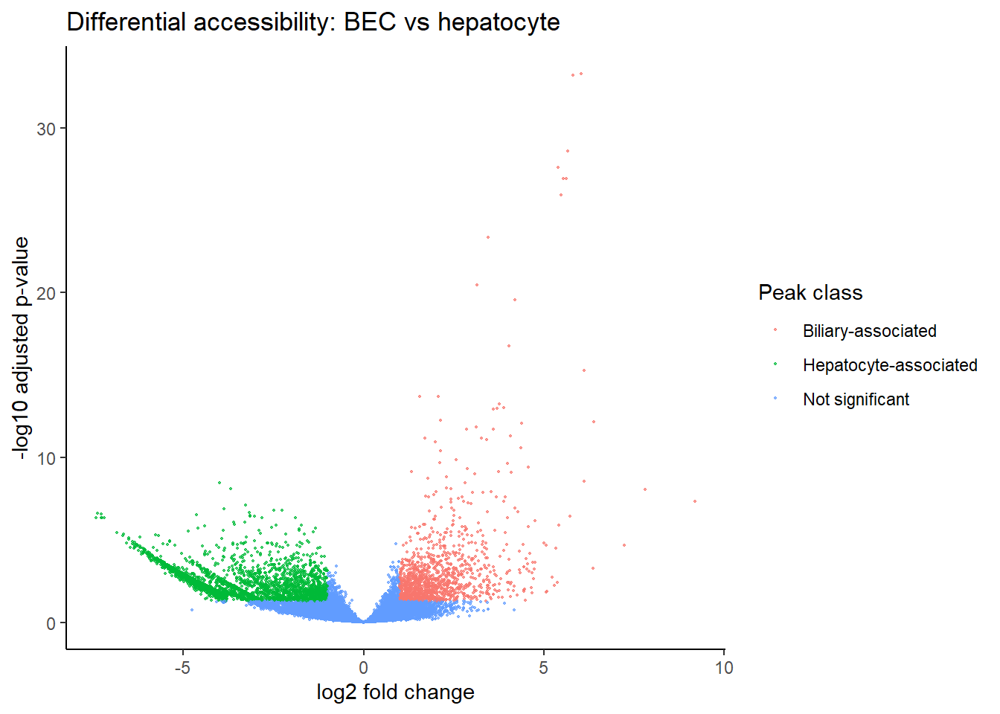
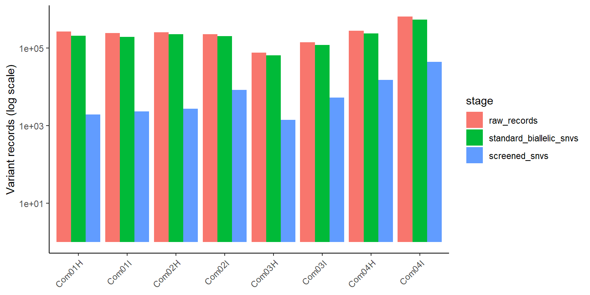
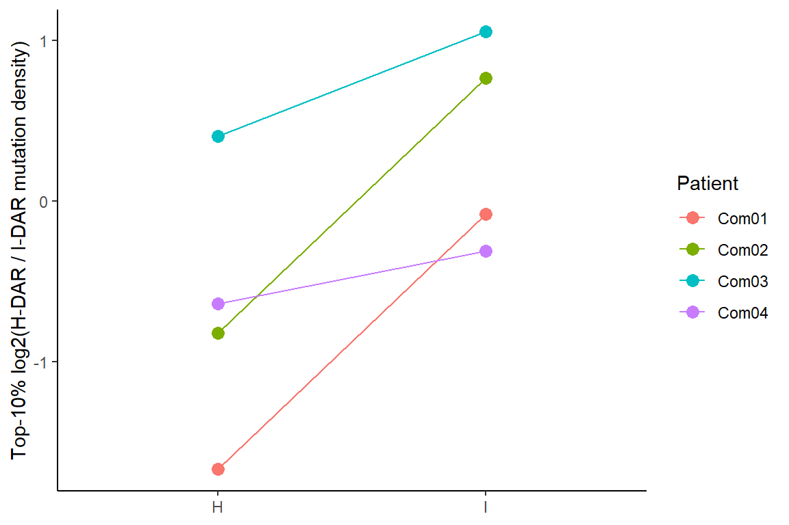

# Chromatin-Associated Mutation Patterns in cHCC-ICC

This repository contains the complete analysis workflow for a first-year student
summer research project on regional mutation patterns in combined
hepatocellular-cholangiocarcinoma (cHCC-ICC).

The five numbered HTML reports contain the complete code, output, figures, and
interpretation for each analysis stage. Download and open them locally for the
best viewing experience.

**Project period:** June 2025 - September 2025<br>
**Supervisor:** Dr. Gladys Poon, Research Assistant Professor, School of Biomedical Sciences, HKUMed<br>
**Analysis status:** workflow completed<br>
**Main question:** after clonally related tumour cells acquire divergent
hepatocellular-like and biliary-like phenotypes, do their mutation distributions
show corresponding relationships with hepatocyte and biliary chromatin?

## Project Overview

Combined-type cHCC-ICC can contain histologically distinct hepatocellular-like
(H) and intrahepatic cholangiocarcinoma-like (I) regions that arise from a
shared tumour clone. Because cell-type-specific chromatin states influence DNA
repair and regional mutation density, this project asked whether the mutation
distributions of these clonally related components also diverge toward
hepatocyte and biliary reference patterns as their phenotypes diverge.

The project first integrated liver organoid scRNA-seq and scATAC-seq data.
Because fragment files were unavailable and the transferred labels had limited
support, bulk ATAC-seq was used instead to define hepatocyte- and
biliary-associated DARs. Screened somatic SNVs from four paired H/I tumours
were then compared across all mapped significant DARs.

Two of the four patient pairs followed the predicted relative
mutation-depletion direction, while two showed the opposite direction
(`p = 1`). The data therefore did not show a consistent relationship between
H/I phenotype and the two reference chromatin patterns. As a first-year
project, the work nevertheless established a complete reproducible workflow
and clarified important limitations in the available data and original
analysis design, providing a stronger methodological foundation for producing
publishable results in subsequent projects.

```text
01 scRNA clustering and annotation
                 |
                 v
02 scATAC integration and label transfer
                 |
                 v
     Label-transfer support was insufficient
                 |
                 v
03 Bulk ATAC: hepatocyte vs biliary ----> lineage-associated DARs
                                                   |
04 Eight tumour VCFs ----> screened SNVs ----------+
                                                   |
                                                   v
05 DAR mutation-density score and paired direction test
```

## Scientific Context

This project is motivated by three related ideas:

- Accessible DNA regions tend to undergo more effective DNA repair and
  therefore accumulate fewer somatic mutations [1].
- Because chromatin accessibility is cell-type-specific, regional mutation
  density can retain information about a tumour's cell type of origin [2].
- The Cancer Cell study showed that the HCC-like and ICC-like components of
  combined-type cHCC-ICC are histologically distinct yet arise from a shared
  tumour clone [3]. Comparing each component with hepatocyte and biliary
  chromatin references tests whether this phenotypic divergence is accompanied
  by corresponding lineage-associated mutation patterns.

## Data Sources

The analysis uses or references:

- eight tumour VCFs representing paired HCC-like and ICC-like components from
  four combined-type cHCC-ICC cases in the Cancer Cell study [3];
- mouse bulk ATAC-seq count data from three biliary and three hepatocyte
  samples;
- liver organoid scRNA-seq and scATAC-seq data from HM and DM conditions [4].

Large raw files and intermediate analysis objects are not stored directly in
this repository.

## Analysis Workflow and Results

### 01. scRNA clustering and annotation

The scRNA-seq workflow reprocesses the HM and DM liver organoid samples,
normalizes the data, performs dimensionality reduction and clustering,
identifies marker genes, and assigns cell-type labels using the reference
study.

**Result:** an annotated scRNA object was generated and used as the reference
for scATAC label transfer.



*UMAP of the 13 scRNA-seq clusters used as the basis for cell-type annotation.*



*Marker-gene overlap between the reprocessed clusters (rows) and the published
reference clusters (columns); the strongest overlaps guided annotation.*

### 02. scATAC integration and label transfer

The scATAC-seq workflow integrates four HM/DM samples using LSI and Harmony.
Because fragment files were not available, gene activity is approximated by
summing counts from peaks overlapping each gene body and its upstream region.
The scRNA-derived labels are then transferred to ATAC cells and assessed using
prediction scores, agreement with unsupervised ATAC clusters, and marker-gene
activity.

**Result:** the transfer produced labels, but prediction confidence was
moderate, concordance with unsupervised clusters was weak, and marker support
was limited. The scATAC annotation was therefore not used as the final
cell-type-specific chromatin reference, and the project moved to bulk ATAC-seq.



*scRNA-derived labels transferred to the integrated scATAC-seq cells.*



*Fractions of transferred labels within each unsupervised ATAC cluster. Several
clusters are divided across multiple labels, indicating limited cluster-level
concordance; this panel assesses label consistency rather than per-cell
prediction confidence directly.*

### 03. Bulk ATAC differential-accessibility analysis

The bulk ATAC workflow prepares the featureCounts peak matrix and compares
three hepatocyte samples with three biliary/BEC samples using DESeq2. Peaks are
classified using `padj < 0.05` and `|log2FoldChange| > 1`, joined back to their
genomic coordinates, and exported as lineage-associated BED files. 

**Result:** the comparison identified 2,951 biliary-associated and 1,217
hepatocyte-associated peaks. The existing lifted human-coordinate files were
reused with their lineage assignments corrected, providing 2,704 biliary and
1,020 hepatocyte intervals for the mutation analysis.



*Total peak counts across the three hepatocyte and three biliary/BEC bulk
ATAC-seq samples before differential-accessibility testing.*



*Differential-accessibility results showing biliary-associated,
hepatocyte-associated, and non-significant peaks.*

### 04. Tumour VCF QC and screening

The VCF workflow reads the eight `Com01-04H/I` tumour samples. All eight are
tumour samples; within each VCF, the tumour genotype is compared with its
matched-normal genotype. Because the supplied Mutect2 records have `FILTER=.`,
the workflow applies a documented screening rule to standard biallelic SNVs
using tumour and normal read depth, alternate-allele support, allele fraction,
and the Mutect2 tumour log-odds score (`TLOD`). The criteria are tumour depth
`>= 30`, tumour alternate reads `>= 5`, tumour allele fraction `>= 0.08`, normal
depth `>= 15`, normal alternate reads `<= 1`, normal allele fraction `<= 0.01`,
and `TLOD >= 6.3`. The same thresholds are applied to every sample.

**Result:** the workflow generated one screened somatic-SNV table and a QC
summary for all eight samples. Depending on the sample, 1,419 to 44,394 SNVs
passed the screening criteria.



*Numbers of raw records, standard biallelic SNVs, and retained SNVs after the
common quality screen; the y-axis is logarithmic.*

### 05. DAR mutation comparison

The final workflow uses all mapped significant hepatocyte- and
biliary-associated DARs on chromosomes 1-22 and X. Overlapping intervals are
merged within each reference, giving 1,010 hepatocyte intervals (0.564 Mb) and
2,696 biliary intervals (1.825 Mb). No genomic bins are selected using the
tumour mutation data.

For each tumour, mutation density is calculated separately across the two DAR
references. The lineage score is the log2 ratio of hepatocyte-DAR to
biliary-DAR mutation density, with a 0.5 pseudocount to keep the ratio finite
when no mutation falls in one reference. Dividing by the total length of each
DAR set accounts for their different genomic coverage. A higher score indicates
more mutations in hepatocyte-associated DARs relative to biliary-associated
DARs, whereas a lower score indicates relative depletion in
hepatocyte-associated DARs.

Under the chromatin-associated mutation-depletion hypothesis, an H sample
should have a lower score than its paired I sample. This direction is tested
within each of the four patients.

**Result:** two patient pairs followed the expected direction and two showed
the opposite direction. The paired differences (`I - H`) were -1.708, 2.037,
-0.933, and 0.881 for Com01-Com04, respectively. The two-sided sign test was
`p = 1`, providing no evidence of a consistent relationship between H/I
phenotype and the two reference chromatin patterns in these four pairs.



*Paired lineage scores for the four patients. Com02 and Com04 rise from H to I,
whereas Com01 and Com03 show the opposite direction.*

## Overall Conclusion

The project completed the full path from single-cell reference construction to
bulk chromatin comparison and tumour mutation analysis. The single-cell ATAC
labels were not sufficiently well supported to serve as the final reference,
but bulk ATAC-seq provided hepatocyte- and biliary-associated DAR sets for a
direct test of the hypothesis. In the all-DAR comparison, two H/I pairs showed
the predicted relative mutation-depletion direction and two showed the opposite
direction (`p = 1`). The analysis therefore found no consistent evidence that
divergence into HCC-like and ICC-like phenotypes was accompanied by a
corresponding shift toward hepatocyte and biliary chromatin-associated mutation
patterns.

The small cohort and sparse mutation counts within DARs limit how strongly this
negative result can be interpreted. Nevertheless, this first complete
bioinformatics project established a reproducible workflow spanning single-cell
integration, bulk ATAC-seq, VCF processing, genomic intervals, and paired
statistical analysis. Re-examining the workflow also exposed weaknesses in the
original data and analysis design, providing a stronger methodological
foundation for producing publishable results in subsequent projects.

## Limitations

- Only four paired patients were analysed, and few screened SNVs fell within
  the DAR references. The resulting 2/4 paired direction (`p = 1`) provides
  little power to detect a consistent relationship.
- The input VCFs did not include variant-level filtering status (`FILTER=.`),
  so a common set of predefined quality thresholds was applied to all samples.
- The samples appear to be whole-exome data, but no capture or callable-region
  BED was supplied, leaving the effective callable length of each DAR set
  uncertain.
- Fragment files were unavailable, so the scATAC-derived clusters and labels
  were not used as the final chromatin reference. A complete single-cell
  analysis could potentially define cell-type-specific chromatin more precisely
  than the bulk comparison.
- The bulk ATAC references came from mouse hepatocyte and biliary samples and
  were converted to human coordinates by liftOver. This may introduce mapping
  inaccuracies and does not directly measure chromatin in the tumour samples.
- The available mutation calls do not determine whether individual mutations
  accumulated before or after H/I phenotypic divergence, so this analysis
  cannot establish the originating normal cell type.

## Repository Structure

```text
.
+-- 01-scRNA-clustering-and-annotating.html
+-- 02-scATAC-integration.html
+-- 03-bulk-ATAC-analysis.html
+-- 04-VCF-QC-and-screening.html
+-- 05-DAR-enrichment-and-classification.html
+-- README.md
```

## Main Analysis Files

| Step | File | Purpose | Outcome |
|---:|---|---|---|
| 01 | [01-scRNA-clustering-and-annotating.html](01-scRNA-clustering-and-annotating.html) | Cluster and annotate liver organoid scRNA-seq data | Annotated scRNA reference |
| 02 | [02-scATAC-integration.html](02-scATAC-integration.html) | Integrate scATAC samples and transfer scRNA labels | Label support was insufficient for the final chromatin reference |
| 03 | [03-bulk-ATAC-analysis.html](03-bulk-ATAC-analysis.html) | Compare three biliary and three hepatocyte bulk ATAC-seq samples and export DARs | 2,951 biliary-associated and 1,217 hepatocyte-associated peaks |
| 04 | [04-VCF-QC-and-screening.html](04-VCF-QC-and-screening.html) | Screen and summarize the eight paired-component tumour VCFs | Screened SNV table and per-sample QC summary |
| 05 | [05-DAR-enrichment-and-classification.html](05-DAR-enrichment-and-classification.html) | Compare paired mutation-density scores across all mapped significant DARs | Expected direction in 2/4 pairs; sign-test `p = 1` |

## Software

The analysis is mainly written in R. Packages used across the project include:

- dplyr
- tidyr
- ggplot2
- data.table
- GenomicRanges
- GenomeInfoDb
- rtracklayer
- VariantAnnotation
- DESeq2
- edgeR
- Seurat
- Signac
- Harmony

## References

1. Polak P, Lawrence MS, Haugen E, et al. *Reduced local mutation density in
   regulatory DNA of cancer genomes is linked to DNA repair.* Nature
   Biotechnology. 2014;32:71-75. [doi:10.1038/nbt.2778](https://doi.org/10.1038/nbt.2778)
2. Polak P, Karlić R, Koren A, et al. *Cell-of-origin chromatin organization
   shapes the mutational landscape of cancer.* Nature. 2015;518:360-364.
   [doi:10.1038/nature14221](https://doi.org/10.1038/nature14221)
3. Xue R, Chen L, Zhang C, et al. *Genomic and Transcriptomic Profiling of
   Combined Hepatocellular and Intrahepatic Cholangiocarcinoma Reveals Distinct
   Molecular Subtypes.* Cancer Cell. 2019;35:932-947.e8.
   [doi:10.1016/j.ccell.2019.04.007](https://doi.org/10.1016/j.ccell.2019.04.007)
4. Kim J-H, Mun SJ, Kim J-H, et al. *Integrative analysis of single-cell RNA-seq
   and ATAC-seq reveals heterogeneity of induced pluripotent stem cell-derived
   hepatic organoids.* iScience. 2023;26:107675.
   [doi:10.1016/j.isci.2023.107675](https://doi.org/10.1016/j.isci.2023.107675)

## Notes

The reports preserve the local Windows file paths used in the original code;
reproducing the workflow on another computer requires updating those paths.
